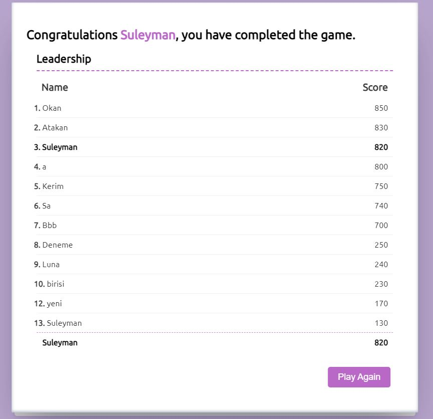
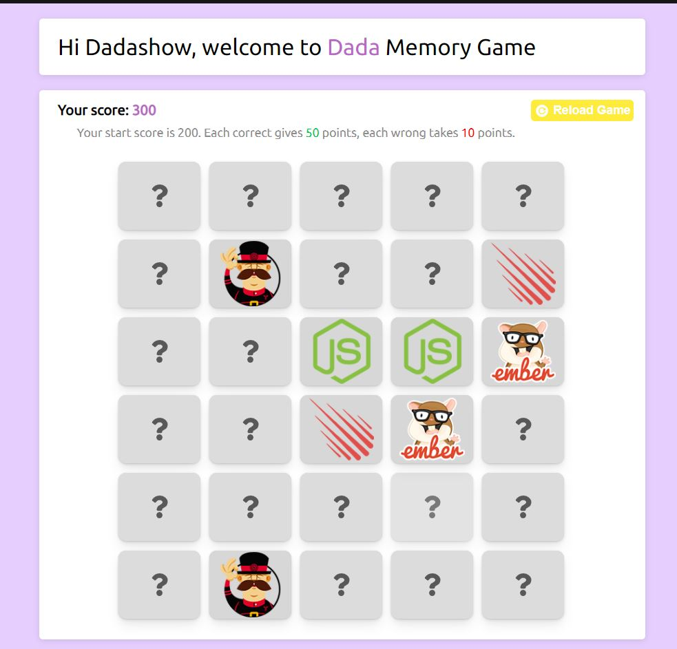

# Dada Memory Game

## You should find same pictures for getting points.

- The application is made using redux structure.
- The points you collect are recorded. You can see the order at the end of the game.
- The data is kept in the Firebase database .

### [Game link (click me)](https://dadamemorygame.netlify.app/)

---

